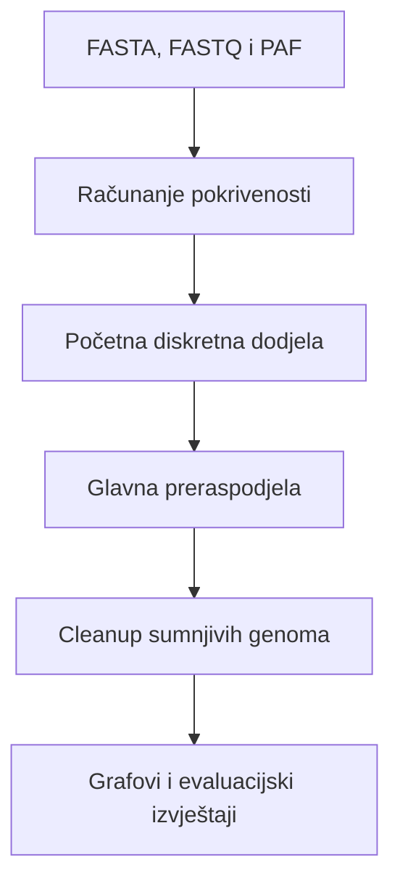

# Metagenomic Coverage Analysis

Programsko rješenje za analizu profila pokrivenosti i preraspodjelu višestruko mapiranih očitanja u simuliranim metagenomskim uzorcima. Razvijeno je u sklopu završnog rada **Analiza metagenomskog uzorka s preraspodjelom očitanja temeljenom na pokrivenosti**.

## Opis

Kod blisko srodnih bakterijskih genoma isto se očitanje može kvalitetno mapirati na više referentnih genoma. Početna dodjela takvih očitanja zato može stvoriti pokrivenost na genomima koji nisu prisutni u uzorku ili narušiti profil pokrivenosti genoma koji jesu prisutni.

Ovaj projekt implementira pipeline koji:

1. učitava simulirana očitanja, referentne genome i PAF mapiranja dobivena alatom minimap2;
2. računa profile pokrivenosti po pretincima zadane veličine;
3. izrađuje početnu diskretnu dodjelu očitanja na temelju najboljih MAPQ vrijednosti;
4. iterativno preraspodjeljuje višestruko mapirana očitanja prema kvaliteti poravnanja i obliku profila pokrivenosti;
5. u dodatnoj cleanup fazi prepoznaje sumnjive genome i pokušava premjestiti njihova očitanja na prikladnije alternative;
6. generira grafove, statistike i evaluacijske izvještaje usporedbom s poznatim stanjem iz simulatora.

Osnovna je pretpostavka da genom prisutan u uzorku treba imati relativno ravnomjernu pokrivenost duž većeg dijela sekvence. Fragmentirana, izrazito lokalizirana pokrivenost ili izolirani šiljci mogu upućivati na pogrešno dodijeljena očitanja.

## Tijek obrade



### Početna dodjela

Za svako se očitanje zadržavaju poravnanja s najvećom MAPQ vrijednošću. Jednoznačno mapirana očitanja odmah se dodjeljuju odgovarajućem genomu. Očitanja s više jednako dobrih kandidata grupiraju se prema skupu kandidatnih genoma te se unutar svake grupe raspodjeljuju što ravnomjernije. Fiksni seed omogućuje reproducibilnost.

### Glavna preraspodjela

Algoritam razmatra samo premještanja podržana postojećim poravnanjima iz PAF datoteke. Kandidatna premještanja vrednuju se kombinacijom:

- lokalne promjene pogreške profila pokrivenosti (SSE),
- podrške jednoznačno mapiranih očitanja,
- sumnjivosti izvornog i odredišnog genoma,
- kvalitete poravnanja opisane oznakama MAPQ, AS i NM.

Najbolja prihvatljiva premještanja primjenjuju se iterativno, uz ponovno računanje pokrivenosti nakon svake iteracije.

### Cleanup faza

Cleanup promatra ukupni oblik završnog profila pokrivenosti. Sumnjivost genoma procjenjuje se signalima koji opisuju:

- udio nepokrivenih pretinaca i najdulji kontinuirani niz nepokrivenih pretinaca;
- koncentraciju pokrivenosti u malom broju pretinaca;
- omjer najveće i srednje pokrivenosti, odnosno lokalni šiljak;
- pražnjenje genoma tijekom glavne preraspodjele.

Očitanje se premješta samo na genom na koji se stvarno mapiralo i koji nije označen kao sumnjiv.

## Struktura projekta

```text
metagenomic-coverage-analysis/
├── scripts/
│   ├── main_simulator.py
│   ├── inicijalna_preraspodjela/
│   ├── algoritam_preraspodjele/
│   ├── parse_i_coverage/
│   ├── statistika/
│   └── vizualizacija/
├── data/                  # ulazni FASTA i FASTQ podaci (nisu u repozitoriju)
├── minimap_output/        # PAF datoteke (nisu u repozitoriju)
├── results/               # generirani rezultati (nisu u repozitoriju)
├── requirements.txt
└── README.md
```

## Preduvjeti

- Python 3.12
- minimap2 za izradu PAF mapiranja
- Python paketi navedeni u `requirements.txt`

Instalacija Python ovisnosti u virtualno okruženje:

```bash
python3 -m venv venv
source venv/bin/activate
python -m pip install -r requirements.txt
```

Na Windowsu se virtualno okruženje aktivira naredbom:

```powershell
venv\Scripts\activate
```

## Ulazni podaci

Pipeline očekuje tri vrste datoteka:

- **FASTA** datoteku reducirane referentne baze, iz koje se čitaju identifikatori i duljine genoma;
- **FASTQ** datoteku simuliranih očitanja, čija zaglavlja sadrže izvorni genom i koordinate potrebne za evaluaciju;
- **PAF** datoteku dobivenu mapiranjem očitanja na referentnu bazu pomoću minimap2.

Za preciznije računanje pokrivenosti preporučuje se PAF s CIGAR oznakom `cg:Z`, koji minimap2 stvara opcijom `-c`:

```bash
minimap2 -x map-ont -c reference.fasta reads.fastq > mapping_cigar.paf
```

Skupovi podataka i PAF datoteke nisu uključeni u repozitorij zbog njihove veličine.

## Konfiguracija i pokretanje

Eksperiment se konfigurira na početku datoteke `scripts/main_simulator.py`. Glavne postavke su:

```python
BUCKET_SIZE = 5000
DATASET = "2b4s"
OZNAKA = "c1"
USE_CIGAR = True

RUN_MAIN_REDISTRIBUTION = True
RUN_CLEANUP = True
USE_CLEANUP_DRAINAGE = True
```

Podržane oznake skupova u trenutačnoj implementaciji su `2b4s`, `5b15s` i `5b15s_add`. Očekivane putanje do ulaznih datoteka definirane su u istoj datoteci i moraju odgovarati lokalnoj strukturi mapa.

Program se pokreće iz korijenske mape repozitorija:

```bash
python scripts/main_simulator.py
```

## Rezultati

Za svako pokretanje program izrađuje zasebnu mapu unutar `results/`. Naziv mape uključuje veličinu pretinca, skup podataka, oznaku uzorka i naziv eksperimenta.

Generirani izlazi obuhvaćaju:

- profile pokrivenosti simulatora, početne dodjele i završne preraspodjele;
- složene grafove za izravnu usporedbu profila;
- osnovne statistike pokrivenosti;
- usporedbu broja dodijeljenih očitanja;
- udaljenosti profila od simuliranog stanja;
- evaluaciju dodjele za prave i lažne genome;
- sažetke glavne preraspodjele i cleanup faze.

## Napomena o evaluaciji

Informacije iz FASTQ zaglavlja koriste se samo za izradu referentne pokrivenosti i naknadnu evaluaciju. Algoritam preraspodjele ne koristi poznati izvor očitanja pri donošenju odluka.

## Autorica

Katarina Benčun

