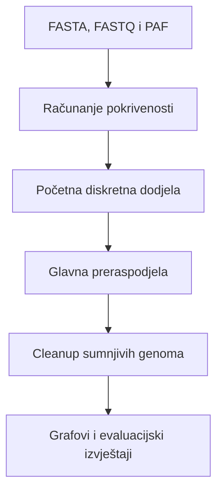

# Metagenomic Coverage Analysis

Programsko rješenje za analizu profila pokrivenosti i preraspodjelu višestruko mapiranih očitanja u simuliranim metagenomskim uzorcima. Razvijeno je u sklopu završnog rada **Analiza metagenomskog uzorka s preraspodjelom očitanja temeljenom na pokrivenosti**.

## Opis

Kod blisko srodnih bakterijskih genoma isto se očitanje može kvalitetno mapirati na više referentnih genoma. Početna dodjela takvih očitanja zato može stvoriti pokrivenost na genomima koji nisu prisutni u uzorku ili narušiti profil pokrivenosti genoma koji jesu prisutni.

Ovaj projekt implementira pipeline koji:

1. učitava simulirana očitanja, referentne genome i PAF mapiranja dobivena alatom minimap2;
2. računa profile pokrivenosti po pretincima zadane veličine;
3. izrađuje početnu diskretnu dodjelu očitanja na temelju najboljih MAPQ vrijednosti;
4. iterativno preraspodjeljuje višestruko mapirana očitanja prema kvaliteti poravnanja i obliku profila pokrivenosti;
5. u dodatnoj cleanup fazi prepoznaje sumnjive genome i pokušava premjestiti njihova očitanja na prikladnije alternative;
6. generira grafove, statistike i evaluacijske izvještaje usporedbom s poznatim stanjem iz simulatora.

Osnovna je pretpostavka da genom prisutan u uzorku treba imati relativno ravnomjernu pokrivenost duž većeg dijela sekvence. Fragmentirana, izrazito lokalizirana pokrivenost ili izolirani šiljci mogu upućivati na pogrešno dodijeljena očitanja.

## Tijek obrade



### Početna dodjela

Za svako se očitanje zadržavaju poravnanja s najvećom MAPQ vrijednošću. Jednoznačno mapirana očitanja odmah se dodjeljuju odgovarajućem genomu. Očitanja s više jednako dobrih kandidata grupiraju se prema skupu kandidatnih genoma te se unutar svake grupe raspodjeljuju što ravnomjernije. Fiksni seed omogućuje reproducibilnost.

### Glavna preraspodjela

Algoritam razmatra samo premještanja podržana postojećim poravnanjima iz PAF datoteke. Kandidatna premještanja vrednuju se kombinacijom:

- lokalne promjene pogreške profila pokrivenosti (SSE),
- podrške jednoznačno mapiranih očitanja,
- sumnjivosti izvornog i odredišnog genoma,

Najbolja prihvatljiva premještanja primjenjuju se iterativno, uz ponovno računanje pokrivenosti nakon svake iteracije.

### Cleanup faza

Cleanup promatra ukupni oblik završnog profila pokrivenosti. Sumnjivost genoma procjenjuje se signalima koji opisuju:

- udio nepokrivenih pretinaca i najdulji kontinuirani niz nepokrivenih pretinaca;
- koncentraciju pokrivenosti u malom broju pretinaca;
- omjer najveće i srednje pokrivenosti, odnosno lokalni šiljak;
- pražnjenje genoma tijekom glavne preraspodjele.

Očitanje se premješta samo na genom na koji se stvarno mapiralo i koji nije označen kao sumnjiv.

## Struktura projekta

```text
metagenomic-coverage-analysis/
├── scripts/
│   ├── main_simulator.py
│   ├── inicijalna_preraspodjela/
│   ├── algoritam_preraspodjele/
│   ├── parse_i_coverage/
│   ├── statistika/
│   └── vizualizacija/
├── data/                  # ulazni FASTA i FASTQ podaci (nisu u repozitoriju)
├── minimap_output/        # PAF datoteke (nisu u repozitoriju)
├── results/               # generirani rezultati (nisu u repozitoriju)
├── requirements.txt
└── README.md
```

## Preduvjeti

- Python 3.12
- minimap2 za izradu PAF mapiranja
- Python paketi navedeni u `requirements.txt`

Instalacija Python ovisnosti u virtualno okruženje:

```bash
python3 -m venv venv
source venv/bin/activate
python -m pip install -r requirements.txt
```

Na Windowsu se virtualno okruženje aktivira naredbom:

```powershell
venv\Scripts\activate
```

## Ulazni podaci

Pipeline očekuje tri vrste datoteka:

- **FASTA** datoteku reducirane referentne baze, iz koje se čitaju identifikatori i duljine genoma;
- **FASTQ** datoteku simuliranih očitanja, čija zaglavlja sadrže izvorni genom i koordinate potrebne za evaluaciju;
- **PAF** datoteku dobivenu mapiranjem očitanja na referentnu bazu pomoću minimap2.

Za preciznije računanje pokrivenosti preporučuje se PAF s CIGAR oznakom `cg:Z`, koji minimap2 stvara opcijom `-c`:

```bash
minimap2 -x map-ont -c reference.fasta reads.fastq > mapping_cigar.paf
```

Skupovi podataka i PAF datoteke nisu uključeni u repozitorij zbog njihove veličine.

## Konfiguracija i pokretanje

Program se pokreće iz korijenske mape projekta. Obavezno je navesti putanje do ulaznih FASTQ, FASTA i PAF datoteka:

```bash
python scripts/main_simulator.py \
  --fastq "putanja/do/ocitanja.fastq" \
  --fasta "putanja/do/referentne_baze.fasta" \
  --paf "putanja/do/mapiranja.paf" \
  --bucket-size 5000 \
  --experiment-name naziv_eksperimenta
```

Putanje mogu biti relativne ili apsolutne, pa ulazne datoteke ne moraju biti spremljene unutar repozitorija.

Dodatnim argumentima moguće je promijeniti izvođenje:

- `--without-cigar` – koristi PAF bez CIGAR zapisa
- `--skip-redistribution` – preskače glavnu preraspodjelu
- `--skip-cleanup` – preskače cleanup fazu
- `--without-drainage` – isključuje drainage signal

Ako se ne navedu, zadana veličina pretinca iznosi 5000 bp, a izvode se glavna preraspodjela, cleanup faza i drainage signal. Svi dostupni argumenti mogu se prikazati naredbom:

```bash
python scripts/main_simulator.py --help
```

## Struktura generiranih izlaza

Za svako pokretanje program izrađuje zasebnu mapu unutar direktorija `results/`. Njezin naziv sastavlja se iz veličine pretinca i naziva eksperimenta zadanog argumentom `--experiment-name`:

```text
results/bucket{veličina_pretinca}_{naziv_eksperimenta}/
```

Primjer:

```text
results/bucket5000_2b4s_c1_finalno/
```

Naziv `2b4s_c1_finalno` u tom primjeru cijeli je tekst koji korisnik preda kroz `--experiment-name`.

Također, generirani izlazi organizirani su u sljedeće mape:

```text
results/bucket5000_2b4s_c1_finalno/
├── profile_kbp/
└── statistika/
    ├── osnovno/
    ├── dodatno/
    └── summaries/
├── usporedba/
│   └── cleanup/
│       ├── true_positive/
│       ├── false_positive/
│       ├── false_negative/
│       └── true_negative/
```

### Grafovi profila pokrivenosti
U mapi `profile_kbp/` nalaze se grafovi za sve genome, ali odvojeno:

- profil pokrivenosti dobiven iz simulatora
- profil nakon početne diskretne dodjele
- konačan profil nakon uključenih faza preraspodjele i čišćenja

U mapi `usporedba/` za svaki se genom nalazi jedna slika koja sadrži sva tri profila, prikazana jedan ispod drugoga.

Ako je cleanup faza uključena, iste se slike dodatno kopiraju u podmapu `usporedba/cleanup/` i razvrstavaju u `true_positive`, `false_positive`, `false_negative` i `true_negative` prema usporedbi cleanup odluke s poznatim stanjem iz simulatora.

### Statistike

Mapa `statistika/osnovno/` sadrži izvještaj s osnovnim podatcima o profilima pokrivenosti nakon početne dodjele i njihovom usporedbom sa simulatorom.

Mapa `statistika/dodatno/` sadrži detaljniju evaluaciju početnog i konačnog stanja:

- `redistribution_comparison.txt` – usporedba broja očitanja i osnovnih statistika pokrivenosti
- `coverage_distance_to_simulator.txt` – MAE i RMSE profila pravih genoma u odnosu na simulator
- `false_genome_coverage_stats.txt` – analiza pokrivenosti genoma koji nisu prisutni u simuliranom uzorku
- `cleanup_truth_evaluation.txt` – evaluacija genoma označenih kao sumnjivi prema poznatom stanju iz simulatora
- `assignment_evaluation/` – evaluacija točnosti dodjele pojedinačnih očitanja prema poznatom podrijetlu iz simulatora

Podmapa `assignment_evaluation/` sadrži detaljnu tablicu po očitanju, matricu zamjene genoma, tablicu rezultata po genomu i tekstualni sažetak evaluacije.

Mapa `statistika/summaries/` sadrži sažetke ulaznog skupa i pojedinih faza obrade:

- `genome_truth_summary.txt` – popis pravih i lažnih genoma prema simulatoru
- `summary_init_assign.txt` – sažetak početne diskretne dodjele očitanja
- `redistribution_summary.txt` – parametri, iteracije i premještanja glavnog algoritma
- `cleanup_simple_summary.txt` – sumnjivi genomi, vrijednosti cleanup signala i provedena premještanja

## Autorica

Katarina Bencun

